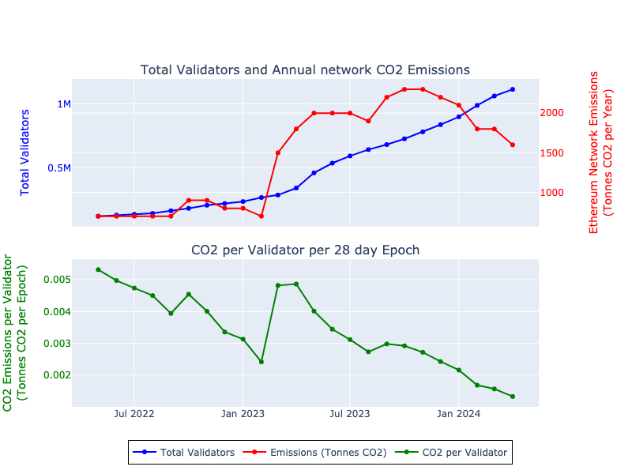

# 🌱 Restake//Regen

🧠 An Eigenlayer AVS that allows Ethereum validators to offset their energy usage by committing to buying and retiring carbon credits.

## Overview

🌏 Despite Ethereums move to proof-of-stake cutting its energy use by over [8000x](https://ethereum.org/en/energy-consumption/), eth still has a network of over 1,000,000 lightweight nodes running varying hardware, emitting roughly [2,000 Tonnes of CO2 annually](https://ccaf.io/cbnsi/ethereum/ghg). 

Protocols like Celo [can claim to be carbon neutral](https://blog.celo.org/a-carbon-negative-blockchain-its-here-and-it-s-celo-60228de36490) because the protocol itself takes a small cut of every block rewards which goes to a carbon offset fund.

Adding this to Ethereum is impossible without a hard-fork however we can get a similar result using Eigenlayer restaking and slashing mechanisms by defining an AVS (Actively Validated Service) that enforces their commitment to subsidising the energy usage of running a node by retiring high quality[ Toucan Biochar (CHAR) carbon credits](https://app.toucan.earth/) on BASE.

Validators register (opt-in) with the AVS with a self-selected % commitment of the total etherium network (between 0.0001% and 1%) and then each epoch (28 days with 13 months a year per the [International Fixed Calendar](https://en.wikipedia.org/wiki/International_Fixed_Calendar)) they must send the required amount of CHAR to the Restake//Regen Funding Pool contract, which is then offset every 1T accumulated by anyone. The offset amount required is defined by a custom [Chainlink Any API](https://docs.chain.link/any-api/get-request/examples/array-response#example) oracle linked to the [Cambridge Blockchain Network Sustainability Index API]( https://ccaf.io/cbnsi/ethereum/ghg).

A validator must contribute CHAR to the Restake//Regen Funding Pool in a block within each epoch, and a recipt of this proof is stored in the funding pool. At any time, anyone (whistleblower) can challenge a validator through the Funding Pool, and claim they didn't make their promised contribution. If the validator did contribute, the receipt is checked and they wont be slashed. If there is no receipt during that epoch, they are slashed by the AVS. 

## Understanding Ethereum's Carbon Footprint
Ethereum has recently risen past 1,000,000 active validator. Eth network Energy and CO2 is difficult to estimate, however is predicted and distributed by the Cambridge Blockchain Network Sustainability Index (CBNSI) provides live estimates of both energy use and carbon expendature [with a thorough methodology](https://ccaf.io/cbnsi/ethereum/ghg/methodology).
Using open source Eth Validator Data from [Bitquery](https://ide.bitquery.io/ETH2-validators-deposits) and the CBNSI Eth CO2 emissions [Data](https://ccaf.io/cbnsi/ethereum/ghg) and [API](https://ccaf.io/cbeci/api/eth/pos/charts/total_greenhouse_gas_emissions/monthly), we calculate a mean annual carbon cost of XXX.

Bit of carbon math
 

Data Sources: 

## System Components

### EigenLayer AVS
- Basic Setup to run the full Eigenlayer stack

### Commitment Registry
- Sign up to the AVS
- 

### Service Manager
A minimal interface to be an Eigenlayer AVS

### Challenge Manager
Allows anyone to challenge if an operator has not made their required retirements and allows an operator to cancel a challenge via CCIP. Calls into ServiceManager to perform slashing.
 - AnyAPI

### Funding Pool (Base)
Allows anyone to call the `contribute` function to gain a receipt of the CHAR tokens being retired on behalf of a staker/operator. These tokens are pooled before burning (retirement must be in 1T increments). Stores the retirement and allows proofs of this to be sent to L1 to clear challenges at a later date
 - Contribute
 - Challenge
 - Retire
 - Retirement Receipts 

### Toucan
Toucan is a well trusted carbon credit cryptocurrecy system based on bridged real world Carbon Credits from Vera and Gold Standard.
Toucan recently deployed their high quality CHAR credits, currently priced at ~$160 USD (May 4, 2024).
The total annual network cost would thus be $320,000 per year, or <$3.20 per validator.

### Worldcoin ID Points System
We use Worldcoin Proof of Personhood for sybil restistance to our non-linear points system.
...... Restake//Regen AVS stakers receive bonus points on on signup, and rewards over time for their ongoing commitment to their carbon offsets.

### Slashing flow (from Base Sepolia to Sepolia)

Base Sepolia

- Slasher calls into contract on Base Sepolia passing epoch and validator/operator address they want to attempt to slash
- contract reads from storage the amount that operator deposited for the given epoch
- This is sent to the CCIP router with the target address given as our ChallengeManager contract on Sepolia L1

---

Sepolia L1

- CCIP receiver calls into our slasher contract with the "evidence". ChallengeManager contract checks if this constitues a slashable offence (e.g. epoch has ended, amount is less than committed to by validator) and slashes the given validator if required.

